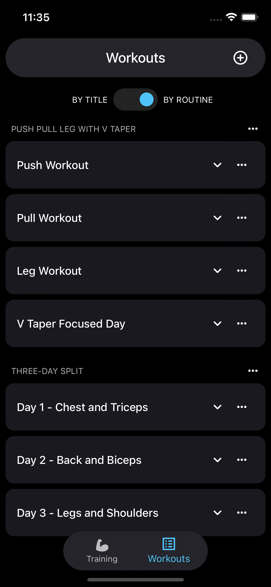

# Workout Builder - NextJS App / PWA

> Personal project.

## Table of contents

- [General info](#general-info)
- [Screenshots](#screenshots)
- [Technologies](#technologies)
- [To-do list](#to-do-list)
- [See live](#see-live)
- [Run locally](#run-locally)

## General info

Organising workouts with sortable exercises into routines.

## Screenshots



## Technologies

- NextJS
- Firebase
- Drag to reorder lists
- Progressive Web App / Add to home screen / Custom install prompt
- MUI 5 for UI components
- Internet connection in-app snackbar notifications
- Guthub webhook for in-app nortifications on updates to repo

## To-do list

- Improve folder and pathnames structure eg. /editor/workout/[id] instead of /workout-editor?id=xxxxxxxxx
- Refactor/Reorganise components into individual files where created in a single file
- Finish current workout page (/start)
- Replace calendar with summary component
- Improve/Finish auth screens eg. add forgotten password
- Create menu and user profile components

## See live

Visit [this link](https://workout-builder.vercel.app/)

---

---

---

## See live

This is a [Next.js](https://nextjs.org/) project bootstrapped with [`create-next-app`](https://github.com/vercel/next.js/tree/canary/packages/create-next-app).

## Run locally

First, run the development server:

```bash
npm run dev
# or
yarn dev
```

Open [http://localhost:3000](http://localhost:3000) with your browser to see the result.

You can start editing the page by modifying `pages/index.tsx`. The page auto-updates as you edit the file.

[API routes](https://nextjs.org/docs/api-routes/introduction) can be accessed on [http://localhost:3000/api/hello](http://localhost:3000/api/hello). This endpoint can be edited in `pages/api/hello.ts`.

The `pages/api` directory is mapped to `/api/*`. Files in this directory are treated as [API routes](https://nextjs.org/docs/api-routes/introduction) instead of React pages.

## Learn More

To learn more about Next.js, take a look at the following resources:

- [Next.js Documentation](https://nextjs.org/docs) - learn about Next.js features and API.
- [Learn Next.js](https://nextjs.org/learn) - an interactive Next.js tutorial.

You can check out [the Next.js GitHub repository](https://github.com/vercel/next.js/) - your feedback and contributions are welcome!

## Deploy on Vercel

The easiest way to deploy your Next.js app is to use the [Vercel Platform](https://vercel.com/new?utm_medium=default-template&filter=next.js&utm_source=create-next-app&utm_campaign=create-next-app-readme) from the creators of Next.js.

Check out our [Next.js deployment documentation](https://nextjs.org/docs/deployment) for more details.
